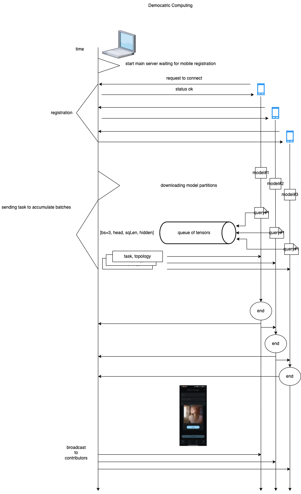
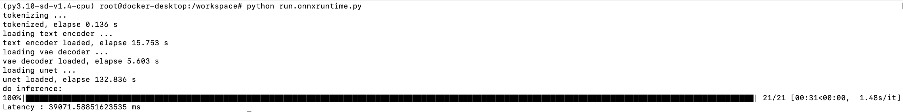

# stable-diffusion-v1-4_onnxruntime



## Preparation

#### config git-lfs first, this make sure onnx model downloaded automatically

###### OSX

```
brew install git-lfs
```

###### Linux

```
apt-get update && apt-get install gt-lfs
```

#### fetch diffusers, stable-diffusion v-1.4 model card

```
git submodule update --init --recursive
```

#### Build docker image

```
docker build -f docker/Dockerfile.ubuntu-20.04.dev -t sd-v1.4-cpu:latest .
```

#### Go into docker container

```
# If you are using docker desktop, make sure you have sufficient memories for a container. 
# Defaults to 2 GB , recommended with 6 GB to run this model in CPU
bash create_image.sh
docker start -a -i sd-v1.4-cpu-$USER-dev
```

#### Build

make sure stable-diffusion v-1.4 is downloaded

```
git-lfs install
git-lfs pull

# you should see model.onnx :
# (py3.10-sd-v1.4-cpu) root@docker-desktop:/workspace# ls stable-diffusion-v1-4/text_encoder/ -lh
# total 481M
# -rw-r--r-- 1 root root 470M Sep  6 19:02 model.onnx
```

build diffuers , install python dependencies

```
bash scripts/build.sh
```

start demo

```
python run.onnxruntime.py
```

